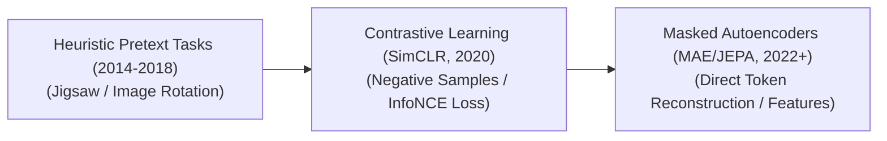

# Awesome-Self-Supervised-Learning
## Self-Supervised Learning (SSL): Evolution, Variants, Types, & Applications

Self-Supervised Learning (SSL) is a machine learning paradigm that eliminates the need for expensive, human-annotated datasets by generating training signals directly from the raw data itself. The algorithm treats part of the data as a target to predict (e.g., masking a word or an image patch) and uses the remaining data as context. By designing specialized "pretext tasks," SSL allows models to learn rich, foundational semantic representations from billions of uncurated images, audio files, or text streams, which can then be fine-tuned on downstream tasks using minimal labels.

---

## 1. The Chronological Evolution

The algorithmic progression of SSL reflects a transition from rigid, hand-crafted geometric pretext tasks to dual-tower contrastive networks, moving toward non-contrastive feature prediction and unified masked autoencoders.

*   **The Early Heuristic Pretext Era (~2014–2018)**
    *   *Concept:* Models were trained on engineered, pseudo-label tasks. Common computer vision methods included predicting the rotation angle of an image (0°, 90°, 180°, 270°) or solving a scrambled 3x3 patch jigsaw puzzle.
    *   *Limitation:* Representations were often tied too closely to the specific tricks of the pretext task, lacking global semantic generalization.
*   **The Contrastive Learning Era (~2020–2022)**
    *   *Concept:* Popularized by architectures like **SimCLR** and **MoCo**. It defined representation learning as a matching game: augment an image twice (e.g., crop and color jitter) and push their vectors close together in embedding space while pushing apart "negative" samples (different images) using the InfoNCE loss function.
    *   *Limitation:* Requires massive batch sizes or memory banks to host enough negative samples to prevent the embedding space from collapsing.
*   **The Masked Autoencoding & Joint Embedding Era (~2022–Present)**
    *   *Concept:* Pioneered in text by BERT and adapted to vision by Meta's **Masked Autoencoders (MAE)** and **Joint Embedding Predictive Architectures (I-JEPA)**. MAE hides up to 75% of an image's pixel patches and forces a transformer to reconstruct them, while JEPA avoids pixel-level noise entirely by predicting hidden *feature representations* rather than raw pixels.

---

## 2. Core Algorithmic & Objective Variants

Self-supervised frameworks are strictly categorized based on how they calculate their loss functions and prevent mathematical representation collapse (where the model maps all inputs to a single static vector).

*   **Contrastive Learning**
    *   *Mechanism:* Directly measures similarities and differences between pairs of data points. It uses a cross-entropy-style loss (InfoNCE) to attract positive views and repel negative views.
    *   *Examples:* SimCLR, MoCo (Momentum Contrast), and CLIP (Vision-Language Contrast).
*   **Non-Contrastive / Clustering Methods**
    *   *Mechanism:* Eliminates negative samples entirely. It trains a dual-tower network where both branches look at different augmentations of the *same* image, using architectural constraints (like stop-gradients or clustering layers) to prevent collapse.
    *   *Examples:* **BYOL** (Bootstrap Your Own Latent), **SwAV**, and **SimSiam**.
*   **Information-Maximization (Variance-Covariance Regularization)**
    *   *Mechanism:* Operates on the principle of information theory. It decorrelates the features across the embedding dimensions, mathematically forcing the network to utilize its entire capacity rather than compressing data onto a single redundant axis.
    *   *Examples:* **Barlow Twins** and **VICReg** (Variance-Covariance-Invariance Regularization).
*   **Masked Prediction (Autoregressive & Masked Autoencoding)**
    *   *Mechanism:* Randomly hides parts of the token sequence or pixel patches and uses the surrounding visible elements to infer the missing contents.
    *   *Examples:* GPT (causal autoregressive), BERT (masked language modeling), and MAE (masked vision autoencoding).

---

## 3. Modality Implementation Types

SSL operates cross-modally, serving as the foundational engine for modern multi-modal and specialized deep learning architectures.

*   **Natural Language Processing (NLP)**
    *   *Implementation:* Uses massive unannotated text corpora to predict the next word or fill in omitted sentence blanks, capturing grammatical syntax, logic boundaries, and world knowledge naturally.
*   **Computer Vision (Self-Supervised Vision)**
    *   *Implementation:* Splits images into grids of visual tokens or patches. Models learn spatial geometries, color textures, and edge constraints through contrastive pairings or masked patch restoration.
*   **Audio & Speech Processing**
    *   *Implementation:* Models like **wav2vec 2.0** mask sections of raw audio waveforms and pass them through convolutional and transformer layers to predict quantized latent representations, learning phonemes and vocal cadences without text transcripts.

---

## 4. Fundamental Challenges & Mitigations

*   **Representation Collapse**
    *   *The Phenomenon:* If a network is trained to output identical vectors for two views of the same image without a regularizing force, it will quickly learn a trivial solution: outputting a constant vector (e.g., all zeros) for *every* image.
    *   *Mitigation:* Implementing **asymmetric architectures** (adding a predictor MLP to only one tower), utilizing **stop-gradient operations** (BYOL), or enforcing **identity covariance matrices** (Barlow Twins).
*   **High Computational Footprint**
    *   *The Phenomenon:* Contrastive setups depend heavily on viewing vast amounts of negative comparisons simultaneously to build accurate boundaries.
    *   *Mitigation:* Deploying **Momentum Consumers (MoCo)** which use a continuous queue system to decouple negative batch size scaling from active GPU memory constraints.

---

## 5. Frontier Real-World Applications

*   **Medical Image Diagnostics (Sparse Label Adaptation)**
    *   *Application:* Hospitals possess millions of medical scans (X-rays, MRIs) but very few high-quality annotations. SSL pre-trains a vision encoder on the raw imagery to learn clinical anatomy markers, allowing a final downstream model to diagnose rare pathologies using fewer than 100 labeled patient cases.
*   **Foundation Multi-Lingual Foundation Models**
    *   *Application:* Web crawls provide trillions of lines of unannotated multilingual text. Masked and autoregressive SSL objectives allow models to construct shared linguistic embedding maps, translating or reasoning across resource-scarce languages without explicit bilingual dictionaries.
*   **Industrial Robotics & Autonomous Exploration**
    *   *Application:* Robots running **World Models** (like JEPA) map physical mechanics and object movements via video inputs. By predicting the next semantic frame feature during mock tasks, the robot learns physical acceleration, depth constraints, and collision rules without manual code configuration.

