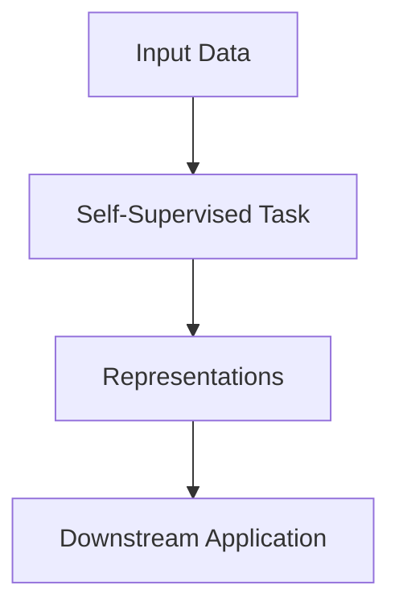

# Medical Image Diagnostics (Sparse Label Adaptation)

## Overview
Detailed information regarding Medical Image Diagnostics (Sparse Label Adaptation) in the context of Self-Supervised Learning.

## Architecture / Concept Diagram

## Deep Dive
This approach has revolutionized the field by enabling robust feature extraction without manual labels...

[Back to main](../README.md)
